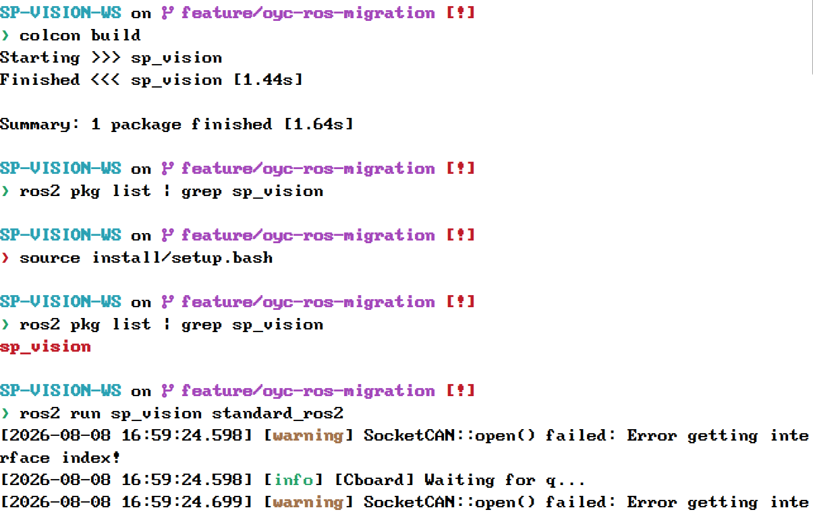

# 开发记录
## <div align = "center">M2</div>

### 完善 io/CMakeLists 与 ROS2 ros_imu 构建

本次目标是完善 `src/sp_vision/io/CMakeLists.txt`，使非 ROS2 构建不编译 ROS2 相关源码，ROS2 环境下也只编译 `ros_imu`。

### 所遇问题与解决方案

#### 问题一：`ros_imu` 源码存在编译错误

启用 ROS2 `ros_imu` 编译后，暴露出 `create_subscription(...)` 语句缺少分号、缺少 `tools/logger.hpp`、回调参数使用 `ConstUniquePtr` 导致 unique_ptr 删除器类型不匹配等问题。

解决方案：补充分号和 logger 头文件，将订阅回调类型改为 `autoaim_msgs::msg::Orienta::ConstSharedPtr`，并让 ROS 回调直接把四元数数据写入线程安全队列。

#### 问题二：`ROSIMU` 构造阶段存在阻塞风险

原 `ROSIMU` 构造函数中启动了未定义的 `get_imu_data_thread()`，随后立即 `queue_.pop()` 两次等待 IMU 数据。ROS2 节点还未开始 spin 时构造函数就等待队列数据，存在构造阶段死锁风险。

解决方案：移除未实现的后台线程逻辑，改为在 `imu_at()` 首次调用时再从队列读取两帧初始数据用于插值。

#### 问题三：`ros2 run` 下模型资源路径依赖当前工作目录

source 工作区后再次运行节点，程序在加载分类模型时报错 `Can't read ONNX file: assets/tiny_resnet.onnx`。原因是配置文件中的模型路径为 `assets/...`，原代码直接按进程当前工作目录解析路径；通过 `ros2 run` 启动时当前目录不一定是 `src/sp_vision`，因此安装后的资源文件无法被稳定找到。

解决方案：新增路径解析工具 `tools/path.hpp`。当配置中的路径不是绝对路径且当前目录下不存在该文件时，按 `config_path` 所在包目录解析，例如将安装环境中的 `assets/tiny_resnet.onnx` 解析到 `install/sp_vision/share/sp_vision/assets/tiny_resnet.onnx`。分类器和 YOLOV5、YOLOV8、YOLO11 的模型加载均接入该路径解析逻辑。

#### 问题四：`standard_ros2` 默认配置路径仍依赖源码目录

`standard_ros.cpp` 原默认参数为 `src/sp_vision/configs/standard3.yaml`。从工作区根目录运行时该路径可能存在，但通过安装空间或其他目录运行时并不可靠；从 `src/sp_vision` 目录运行则会直接找不到配置文件。

解决方案：使用 `ament_index_cpp::get_package_share_directory("sp_vision")` 获取 ROS2 安装后的 package share 目录，将默认配置路径设置为 `share/sp_vision/configs/standard3.yaml`；同时在 `CMakeLists.txt` 和 `package.xml` 中补充 `ament_index_cpp` 依赖。

#### 问题五：OpenVINO 配置为 GPU，但当前机器没有可用 GPU 设备

修复模型路径后，节点继续在 YOLO 模型编译阶段崩溃。配置文件中 `device: GPU`，但当前环境没有 OpenVINO 可用的 GPU 设备，报错 `no supported devices found`。

解决方案：不切换 ONNX Runtime，保留原 OpenVINO 推理逻辑。在 YOLOV5、YOLOV8、YOLO11 的模型编译处增加最小 fallback：按配置设备编译失败且设备不是 CPU 时，记录警告并自动降级到 CPU 重新编译模型。模型、输入预处理、后处理逻辑保持不变。

#### 问题六：本机缺少 CAN 接口导致 SocketCAN 警告

节点成功启动后仍持续输出 `SocketCAN::open() failed: Error getting interface index!`。该问题来自当前机器没有配置文件中指定的 CAN 网络接口，属于硬件/系统网络接口环境问题，不是模型加载或 ROS2 节点构建错误。

解决方案：本次未改变 CAN 原有逻辑，仅确认该警告不再导致节点崩溃。实际机器人运行时需要确保配置中的 `can_interface` 对应系统中存在的 CAN 接口。

### 验证结果

执行以下命令完成验证：

```bash
colcon build --packages-up-to sp_vision --event-handlers console_direct+
source install/setup.bash && ros2 run sp_vision standard_ros2
```

验证结果：`autoaim_msgs` 和 `sp_vision` 均构建成功，`standard_ros2` 已成功编译、链接并安装。执行 `ros2 run sp_vision standard_ros2` 后，节点不再因 ONNX 路径或 OpenVINO GPU 设备不可用而崩溃，能够完成初始化并进入 ROS2 spin；剩余 SocketCAN 警告为本机缺少 CAN 接口导致。


## <div align = "center">M1</div>
### 实现
M1实现了自瞄系统的主入口ROS2节点化，可使用`colcon build`构建并能成功运行。

--- 

### 修改
1. 新增`standard_ros2`节点：ROS2化`standard.cpp`的主程序。
2. 修改`CMakeLists.txt`：删除了原有的依赖包检查和原有的ROS2构建步骤，修改为新的`standard_ros.cpp`构建步骤，并完善了包的安装。

--- 

### 已知问题

- [ ] 暂无测试程序对数据流程进行测试

- [ ] 原有开源项目的代码全数保留，导致编译时间过长


## 第一次编译尝试与环境依赖解决
已将sp_vision整理成一个包，尝试构建，解决环境依赖问题。
### 所遇问题与解决方案
#### 问题一：首次构建命令被工具超时中断

执行 `colcon build --executor sequential` 后，命令在 1 秒前台执行限制内被中断，只输出了 `Starting >>> sp_vision`。

解决方案：使用更长的执行超时时间重新运行同一命令，确认实际构建结果，而不是将工具超时误判为编译失败。

验证结果：确认 `sp_vision` 随后确实进入编译阶段，并暴露出真实的依赖版本问题。

#### 问题二：链接阶段出现 fmt v8 未定义引用

构建过程中出现大量 `undefined reference to fmt::v8` 错误。项目源码和系统 `spdlog 1.9.2` 使用 `fmt 8.1.1` ABI，但 CMake 缓存中的 `fmt::fmt` 被解析到了 Anaconda 的 `/media/usr/Data/anaconda3/lib/libfmt.so.11.2.0`。

解决方案：重新配置构建时，将 `fmt_DIR` 和 `spdlog_DIR` 固定为系统 CMake 包目录，避免链接 Anaconda 的 `fmt 11`。

验证结果：链接命令改为使用 `/usr/lib/x86_64-linux-gnu/libfmt.so.8.1.1`，不再出现 `fmt::v8` 未定义引用。

#### 问题三：编译阶段混入 Anaconda 的 fmt v11 头文件

即使链接库已切换到系统版本，编译仍出现 `fmt::basic_runtime` 不存在以及 `spdlog` 格式字符串相关错误。检查生成的 `flags.make` 后发现编译参数包含 `-isystem /media/usr/Data/anaconda3/include`，导致 Anaconda 的 `fmt 11.2.0` 头文件覆盖了系统 `fmt 8.1.1` 头文件。

解决方案：继续检查 CMake 缓存和传递依赖，发现 Ceres 相关依赖仍使用 Anaconda 的 TBB、glog、gflags 配置，并将 Anaconda include 目录传递给目标。将 `TBB_DIR`、`gflags_DIR` 和 `glog_DIR` 也固定到系统 CMake 包目录。

验证结果：编译参数不再包含 Anaconda include；编译器使用系统 `fmt 8.1.1` 头文件，`spdlog` 相关错误消失。

#### 问题四：多个依赖同时被 Anaconda CMake 配置选中

构建缓存还曾使用 Anaconda 的 `yaml-cpp` 和 `nlohmann_json` 配置，造成头文件和库来源混杂，增加 ABI 不一致风险。

解决方案：将 `yaml-cpp_DIR` 固定为 `/usr/lib/x86_64-linux-gnu/cmake/yaml-cpp`，将 `nlohmann_json_DIR` 固定为 `/usr/lib/cmake/nlohmann_json`，并与系统 `fmt`、`spdlog`、TBB、glog、gflags 配置一起重新配置构建。

验证结果：构建链接命令使用系统 `libyaml-cpp.so`、系统 `fmt`、系统 `glog`、系统 `gflags` 和系统 TBB，依赖来源统一。

#### 问题五：最终构建验证

修复后需要确认用户最初要求的原始命令可以直接运行，而不是只验证带额外 CMake 参数的命令。

解决方案：重新执行 `colcon build --executor sequential`。

验证结果：`sp_vision` 构建成功，耗时约 4.89 秒，最终摘要为 `1 package finished`。仅保留 ROS2 未找到和没有 `install` target 的警告，不影响编译结果。

#### 问题五：实际编译并行度为 20，导致系统高负载卡死

上次构建记录显示，虽然命令行使用了 `--parallel-workers 2` 和 `-DCMAKE_BUILD_PARALLEL_LEVEL=2`，但 Colcon 最终调用 Make 时仍执行了 `cmake --build ... -- -j20 -l20`。设备只有约 15 GiB 内存且没有交换分区，构建在 `auto_aim` 的 `yolo.cpp` 附近达到 39% 后中断，存在因编译任务过多导致桌面失去响应的风险。

解决方案：在工作区新增 `colcon_defaults.yaml`，将 Colcon 包并行度和 CMake 并行参数固定为 2；同时在用户 `.bashrc` 中设置 `MAKEFLAGS=-j2 -l2` 和 `CMAKE_BUILD_PARALLEL_LEVEL=2`，避免 Colcon 的 CMake 任务根据 CPU 核数自动追加 `-j20`。

#### 问题六：系统 spdlog 与 Anaconda 依赖混用

重新构建后发现，系统 `/usr/include/spdlog` 与 Anaconda 的 `fmt`、TBB、gflags、glog、yaml-cpp、nlohmann_json 配置混用，导致 `fmt::basic_runtime` 不存在等编译错误。该问题与之前记录的 fmt ABI 不一致问题属于同一类依赖来源污染。

解决方案：在 `colcon_defaults.yaml` 中固定使用系统 CMake 包目录：`fmt`、`spdlog`、`yaml-cpp`、`nlohmann_json`、`TBB`、`gflags` 和 `glog`，并重新配置 CMake 缓存，避免 Anaconda 的头文件和库继续混入构建。

#### 问题七：ROS2 目标缺少依赖传递和链接配置

启用 `standard_ros2` 后，首先出现 `cv_bridge/cv_bridge.h` 找不到，原因是目标没有通过 `ament_target_dependencies` 继承 ROS2 依赖的头文件目录。随后手动链接 `rclcpp`、`sensor_msgs` 和 `cv_bridge` 又导致链接器找不到对应的普通库名；移除这些手动库名后，还需要显式链接系统 `fmt::fmt`。

解决方案：在顶层 `CMakeLists.txt` 中为 `standard_ros2` 添加 `ament_target_dependencies(standard_ros2 rclcpp sensor_msgs cv_bridge)`，保留 `fmt::fmt` 等普通库的 `target_link_libraries` 配置，不再将 ROS2 包名当作普通库直接链接。

#### 问题八：新增 standard_ros.cpp 存在 ROS2 API 和 C++ 语法问题

`standard_ros.cpp` 中存在缺少类结尾分号、缺少程序入口、使用全局 `rclcpp::create_subscription`、错误读取参数，以及将 ROS 时间消息直接转换为 `std::chrono::nanoseconds` 等问题。

解决方案：改用节点成员函数创建订阅，分别使用 `sec` 和 `nanosec` 计算时间戳，改为通过节点成员读取参数，补充 `rclcpp::init`、节点创建、`spin`、`shutdown` 生命周期，并完善类定义结尾。

#### 问题九：ament_package 使用 Anaconda Python 导致 catkin_pkg 缺失

为 CMake 添加 `ament_package()` 后，构建进入 ROS2 包元数据处理阶段，但 CMake 使用了 `/media/usr/Data/anaconda3/bin/python3`，该环境中没有 ROS2 所需的 `catkin_pkg`，因此出现 `ModuleNotFoundError: No module named 'catkin_pkg'`，安装步骤无法完成。

解决方案：不额外安装 Python 依赖，避免继续混用 Anaconda 与 ROS2 系统环境。在工作区 `colcon_defaults.yaml` 的 CMake 参数中固定 `-DPython3_EXECUTABLE=/usr/bin/python3`，让 `ament_package()` 使用系统 Python 执行 `package.xml` 元数据转换脚本。
